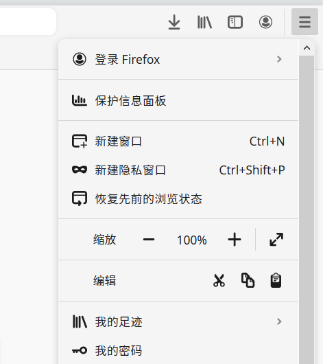
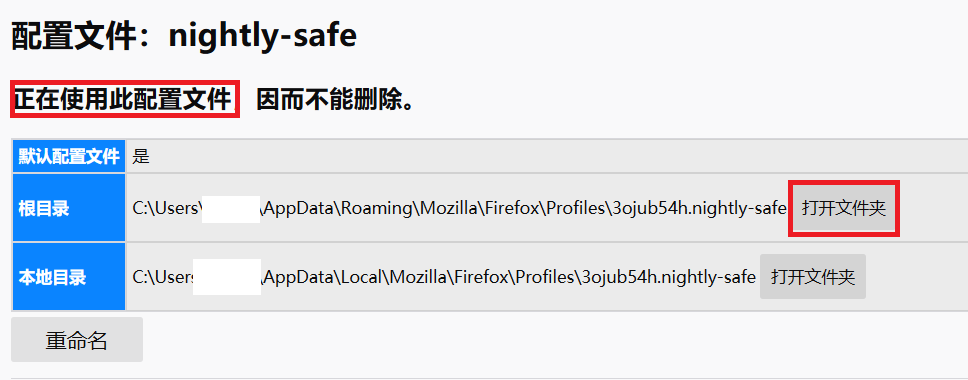

# FluentDotFirefox

[中文](README_zh_cn.md) | English

**If you find a bug, I feel so sorry and please report the bug to issue.**

FluentDotFirefox is a userChrome of firefox for PC. It devotes into modernizing firefox's chrome. And, It combines the Windows Fluent Design and the Firefox Dot Design.

Example:

- Majority Chrome:

- Popup Menu:

- Panel:

FluentDotFirefox bases on firefox's userChrome function.

By means of the powerful function of firefox userChrome, you can implement many function which firefox don't include now.

Building FluentDotFirefox takes a lot of time. It is my pleasure that you donate the project generously if you like it.

You can donate by Wechat:

## Install

1. Turn to `about:config` site in Firefox.

2. Change `toolkit.legacyUserProfileCustomizations.stylesheets` to `true`.

3. Turn to `about:profiles` site in Firefox.

4. Find out the profile used now.

5. Switch to the profile's root location.
   
   

6. Copy 'chrome' folder in FluentDotFirefox to the location.

7. Download and install fonts [Sarasa-Gothic](https://github.com/be5invis/Sarasa-Gothic/releases/download/v0.12.11/sarasa-gothic-ttc-0.12.11.7z). 

8. Change your Firefox theme to "Light".

9. Restart Firefox.

## Get a better experience on firefox

`about:config` : `general.smoothScroll.msdPhysics.enabled` : `true`

## Further

1. Edit the value in `var.css` to change color or font-family.

2. Set about a pull request(only support in Github).

## Annocement

FluentDotFirefox is only support Windows 10 now. It dosn't mean you couldn't use it in MacOS or Linux, but it means the chrome will lose some important characters in other operation systems.
