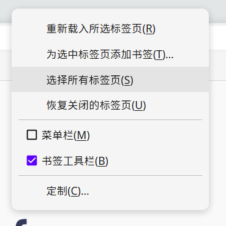
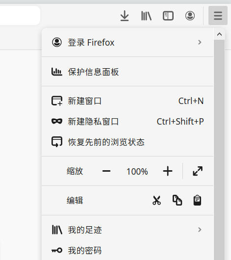
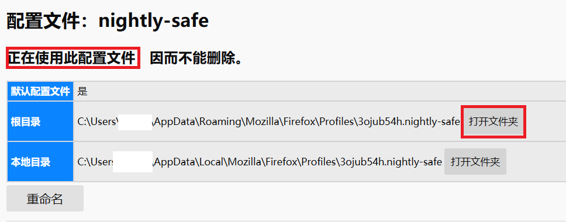

# FluentDotFirefox

中文 | [English](README.md)

**如果您在使用过程中遇到bug，请在issue报告。非常抱歉我在审查bug时可能有所疏漏。**

FluentDotFirefox 是火狐浏览器电脑版的自定义用户界面，致力于让您的火狐浏览器界面现代化。FluentDotFirefox 结合了Fluent Design和Firefox Dot Design以在将其与现代设计元素时保留火狐浏览器的特色。

样例:

- 主界面:

- 弹出菜单:

- 列表菜单:

FluentDotFirefox 基于火狐浏览器的用户界面功能。得益于其强大的拓展能力，你还可以通过这个功能进行更多的创造，实现现在的火狐浏览器所不具备的功能，使你的火狐浏览器更加美观高效、功能丰富。

建立FluentDotFirefox花费了开发者大量的时间。如果您喜欢这个项目，我非常荣幸如果能获得您的支持。

您可以通过微信来捐赠我:

## 安装

1. 在火狐浏览器中转到 `about:config` 页面。

2. 将 `toolkit.legacyUserProfileCustomizations.stylesheets` 修改为 `true`.

3. 在火狐浏览器中转到 `about:profiles` 页面。

4. 找到您正在使用的配置文件。

5. 打开这个配置文件的根目录。
   
   

6. 将 FluentDotFirefox 中的chrome文件夹复制到该目录。

7. 下载并安装字体 [Sarasa-Gothic](https://github.com/be5invis/Sarasa-Gothic/releases/download/v0.12.11/sarasa-gothic-ttc-0.12.11.7z) 。

8. 将您的火狐浏览器主题更改为明亮。

9. 重启火狐浏览器。

## 在火狐浏览器中获得更好的体验

`about:config` : `general.smoothScroll.msdPhysics.enabled` : `true`

## 更进一步

1. 编辑 `var.css` 内的值来改变界面的颜色与字体.

2. 发起 pull request(仅支持Github).

## 告知

FluentDotFirefox 目前仅支持Windows 10。这不意味着它在MacOS、Linux、Windows7上完全无法使用，但是部分功能可能会出现异常。开发者还没在其他系统平台上尝试过，您可以试试。
